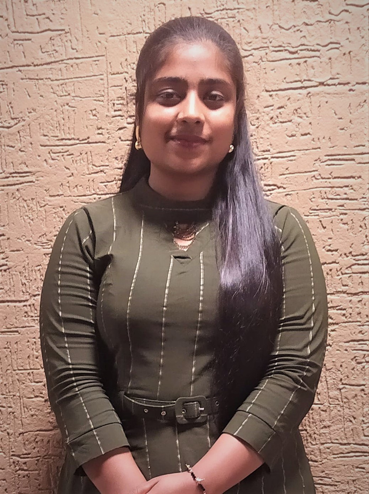
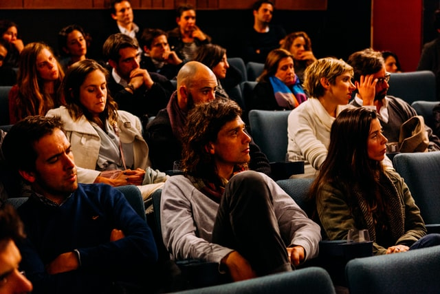

# Priyanshi Mittal
* An aspiring Data Scientist

# [Project 1: Student-Performance Analysis](https://github.com/Priyanshi2205/Student-Performance---Machine-Learning)

Photo by <a href="https://unsplash.com/@antenna?utm_source=unsplash&utm_medium=referral&utm_content=creditCopyText">Antenna</a> on <a href="https://unsplash.com/s/photos/student-performance?utm_source=unsplash&utm_medium=referral&utm_content=creditCopyText">Unsplash</a>
  
In this project I have applied various Machine Learning Models on the student Dataset
* **Models :** KNN, Logistic Regression, SVM, Naive Bayes.

